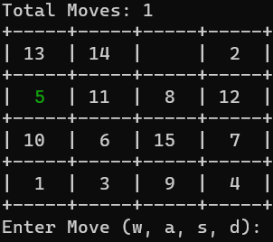

# 15 Game by Anirudh Vetukuri 🎮

The 15 Game is a sliding puzzle game where the objective is to arrange numbers in the grid in ascending order. This implementation is built in Rust and features a command-line interface. 

 

## 🚀 Getting Started

### Prerequisites

- [Rust and Cargo](https://rustup.rs/): This project is written in Rust, so you'll need the Rust compiler and the Cargo package manager to run and build it.

### Running the Game

1. Clone the repository:

```bash
$ git clone https://github.com/AnirudhVetukuri/15_Game.git
$ cd fifteen_game
```

2. Run the game:

```bash
$ cargo run
```

### 🕹 How to Play

- Use the `w`, `a`, `s`, and `d` keys to slide the tiles up, left, down, and right.
- Your objective is to arrange the numbers in ascending order (If a piece is in the right position it will turn green!)
- The game ends once you've successfully arranged all the tiles!

## 💻 Development

### Running Tests

This project has also been built with unit tests to ensure its functionality. You can run them with:

```bash
$ cargo test
```
